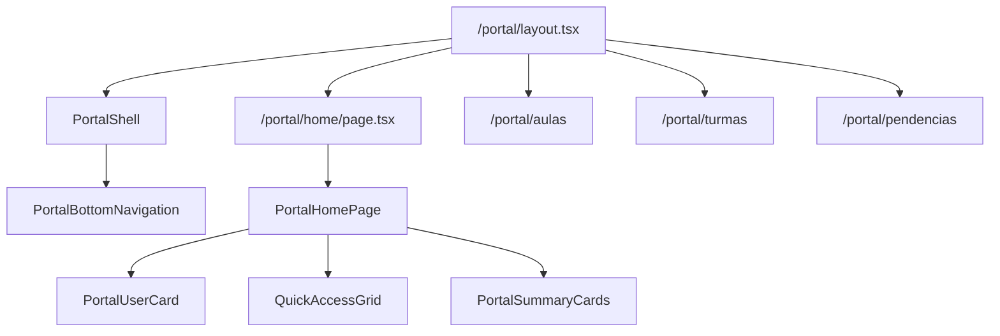

# Portal Home Design

**Spec**: `.specs/features/portal-home/spec.md`
**Status**: Draft

---

## Architecture Overview

O portal sera implementado como um modulo separado dentro de `src/app/(modules)/portal`, reutilizando o App Router atual. A Home sera uma pagina mobile-first com componentes locais em `src/components/portal`, dados mockados e bottom navigation no layout do portal.



---

## Code Reuse Analysis

### Existing Components to Leverage

| Component / Pattern | Location | How to Use |
| --- | --- | --- |
| shadcn Button/Card primitives | `src/components/ui` | Reuse for buttons/cards if available and visually compatible. |
| `cn` utility | `src/lib/utils.ts` | Compose conditional class names. |
| Lucide Icons | `lucide-react` | Icons for user, aulas, turmas, calendario, historico and pendencias. |
| Dashboard color language | `src/components/dashboard` and global CSS | Keep palette aligned with current dashboard colors. |
| App Router route groups | `src/app/(modules)` | Follow existing module structure. |

### Integration Points

| System | Integration Method |
| --- | --- |
| Next.js App Router | New pages under `src/app/(modules)/portal`. |
| Portal components | New folder `src/components/portal`. |
| Data | Local mock objects only. No services, queries or API calls. |
| Navigation | `next/link` and `usePathname` if active state requires client component. |

---

## Routes

| Route | Purpose | Data |
| --- | --- | --- |
| `/portal` | Optional redirect or simple entry to `/portal/home` depending on existing page decision. | None/mock |
| `/portal/home` | Main mobile-first portal Home. | Mock |
| `/portal/aulas` | Placeholder page. | None |
| `/portal/turmas` | Placeholder page. | None |
| `/portal/pendencias` | Placeholder page. | None |

Note: `Historico` and `Calendario` are quick access items. If routes are not created in this first slice, the cards can point to future routes only after placeholders are added or be rendered as non-primary links. To avoid 404, create placeholders if links are clickable.

---

## Components

### PortalLayout / PortalShell

- **Purpose**: Provide max-width container, mobile-first page padding and bottom navigation area.
- **Location**: `src/app/(modules)/portal/layout.tsx` or `src/components/portal/PortalShell.tsx`.
- **Interfaces**:
  - `children: ReactNode`
- **Dependencies**: `PortalBottomNavigation`.
- **Reuses**: Existing App Router layout pattern.

### PortalBottomNavigation

- **Purpose**: Fixed bottom navigation for Home, Turmas and Aulas.
- **Location**: `src/components/portal/PortalBottomNavigation.tsx`.
- **Interfaces**:
  - No required props if it reads current route with `usePathname`.
- **Dependencies**: `next/link`, `next/navigation`, Lucide icons.
- **Reuses**: Existing navigation styling concepts from dashboard, adapted to mobile.
- **Notes**: Must be a client component if using `usePathname`.

### PortalHomePage

- **Purpose**: Compose the Home sections using mock data.
- **Location**: `src/components/portal/PortalHomePage.tsx`.
- **Interfaces**:
  - Can be prop-less while mock data is local.
- **Dependencies**: `PortalUserCard`, `QuickAccessGrid`, `PortalSummaryCards`.
- **Reuses**: Existing dashboard colors and spacing conventions.

### PortalUserCard

- **Purpose**: Show greeting and user contact summary.
- **Location**: `src/components/portal/PortalUserCard.tsx`.
- **Interfaces**:
  - `user: { nome: string; telefone: string; email: string; role?: string }`
- **Dependencies**: Lucide `UserRound` or similar.
- **Reuses**: Card visual language from dashboard.

### QuickAccessGrid

- **Purpose**: Render two-column grid of quick access cards.
- **Location**: `src/components/portal/QuickAccessGrid.tsx`.
- **Interfaces**:
  - `items: Array<{ label: string; href: string; icon: IconType }>`
- **Dependencies**: `next/link`, Lucide icons.
- **Reuses**: Touch-friendly button/card styles.

### PortalSummaryCards

- **Purpose**: Render compact metrics for Aulas hoje, Proximas aulas, Pendencias and Turmas ativas.
- **Location**: `src/components/portal/PortalSummaryCards.tsx`.
- **Interfaces**:
  - `items: Array<{ label: string; value: string | number; description?: string }>`
- **Dependencies**: None beyond styling.
- **Reuses**: Existing dashboard metric card pattern, simplified for mobile.

### PortalPlaceholderPage

- **Purpose**: Reusable placeholder for Aulas, Turmas and Pendencias.
- **Location**: `src/components/portal/PortalPlaceholderPage.tsx`.
- **Interfaces**:
  - `title: string`
- **Dependencies**: None.
- **Reuses**: Portal shell spacing.

---

## Mock Data

```ts
const mockPortalUser = {
  nome: "Cristiane Santos",
  telefone: "(11) 99999-9999",
  email: "cristiane@email.com",
  role: "PROFESSOR",
};

const mockSummary = [
  { label: "Aulas hoje", value: 2 },
  { label: "Proximas aulas", value: 5 },
  { label: "Pendencias", value: 1 },
  { label: "Turmas ativas", value: 3 },
];
```

---

## Visual Strategy

- Mobile-first layout with generous spacing and touch targets.
- Rounded cards, soft shadows and subtle borders.
- Use the current system palette instead of introducing a new color theme.
- Main content should have bottom padding so fixed navigation does not cover content.
- Desktop should center content with a mobile-app feel, not stretch sections across the full screen.

---

## Error Handling Strategy

| Error Scenario | Handling | User Impact |
| --- | --- | --- |
| Missing mock field | Provide safe fallback string in component. | UI remains readable. |
| Route not implemented | Create placeholder pages for initial navigation. | No 404 for planned links. |
| Small viewport | Use responsive grid and `min-w-0`. | No horizontal overflow. |

---

## Tech Decisions

| Decision | Choice | Rationale |
| --- | --- | --- |
| Data source | Mock local data | Required by spec; avoids coupling portal UI to backend now. |
| Portal structure | Single portal for aluno/professor | User decision: same portal, role changes behavior later. |
| Navigation | Bottom navigation | Best fit for mobile-first app-like UX. |
| UI library | No new library | Existing Tailwind, shadcn/ui and Lucide are enough. |
| Component folder | `src/components/portal` | Keeps portal UI separate from dashboard UI. |

---

## Requirement Mapping

| Requirement | Design Element |
| --- | --- |
| PORTAL-HOME-01 | Route `/portal/home`, `PortalHomePage` |
| PORTAL-HOME-02 | `PortalUserCard` |
| PORTAL-HOME-03 | `QuickAccessGrid` |
| PORTAL-HOME-04 | `PortalSummaryCards` |
| PORTAL-HOME-05 | `PortalBottomNavigation`, portal layout |
| PORTAL-HOME-06 | Placeholder pages |
| PORTAL-HOME-07 | Responsive classes and centered desktop container |
